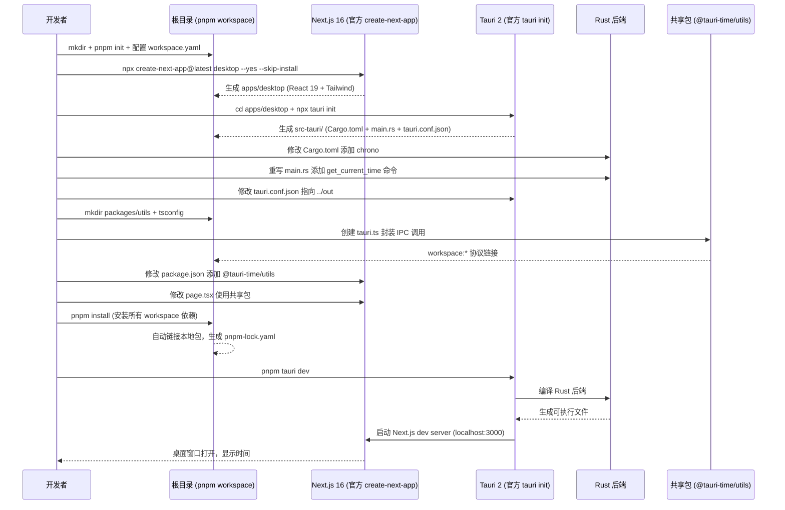

本教程逐步演示从零搭建一个 Tauri 2 桌面应用。主要通过官方工具链，以 Next.js 16 为前端，Rust 为后端，结合 `pnpm workspace` 构建一个可维护的现代化 `monorepo` 项目。教程涵盖了从环境配置、创建项目、集成 Tauri、编写前后端通信代码，到最终打包的完整流程。项目将实现一个可展示实时时间的示例应用，并通过创建共享包来实践模块化开发。
<!--more-->

## 1. 环境检查与准备

```bash
# 检查 Node.js 版本（需要18+）
node --version

# 检查 pnpm（没有则安装）
pnpm --version || npm install -g pnpm

# 检查 Rust（没有则安装）
rustc --version || curl --proto '=https' --tlsv1.2 -sSf https://sh.rustup.rs | sh
# 大陆需要设置镜像源，否则会比较慢
# 1. 设置中科大镜像源（临时生效，只对当前终端窗口有效）
export RUSTUP_DIST_SERVER=https://mirrors.ustc.edu.cn/rust-static
export RUSTUP_UPDATE_ROOT=https://mirrors.ustc.edu.cn/rust-static/rustup
# 2. 重新运行安装命令
curl --proto '=https' -- tlsv1.2 -sSf https://sh.rustup.rs | sh
# 3. 如果还是比较慢可以换清华的
export RUSTUP_DIST_SERVER=https://mirrors.tuna.tsinghua.edu.cn/rustup
export RUSTUP_UPDATE_ROOT=https://mirrors.tuna.tsinghua.edu.cn/rustup/rustup

# 可选步骤：全局安装 Tauri CLI
cargo install tauri-cli #推荐
# 或
npm install -g @tauri-apps/cli
```

> 全局安装 `Tauri CLI` 的好处是可以在任意目录 `tauri init` 快速创建项目。也可以局部安装，接下来主要是使用局部安装的 `Tauri CLI`

## 2. 创建 monorepo 根目录

我们的项目叫 tauri-time，为了演示 monorepo 所以加了一个后缀就成了 `tauri-time-monorepo`

```bash
# 创建项目根目录 
mkdir tauri-time-monorepo
cd tauri-time-monorepo

# 初始化 pnpm 项目（生成 package.json）
pnpm init
```

## 3. 根目录配置 `workspace` 和 `turborepo`(非必要)

编辑生成的 `package.json`：

```json
{
  "name": "@tauri-time/root", // <-- 重要 workspace root
  "version": "1.0.0",
  "private": true,
  "packageManager": "pnpm@9.0.0",
  "scripts": {
    "build": "turbo run build", // <-- 使用 turbo（非必要）
    "dev": "turbo run dev",
    "clean": "turbo run clean",
    "tauri": "pnpm --filter @tauri-time/desktop tauri", // <-- 调用子项目的 script
    "tauri:dev": "pnpm --filter @tauri-time/desktop tauri:dev"
  },
  "devDependencies": {
    "turbo": "^2.0.0" // 可以直接先写后面一起 pnpm install，也可以先安装 pnpm add -D turbo@^2 -w
  }
}
```

*为了方便，`json` 中添加了注释，但实际使用中会报语法报错，删除即可。*

> `"name"` 一定要**修改**为 workspace 根目录名；
> 初始化生成的配置文件可能有一些版本上的区别，例如 `packageManager` 可能是 `10.0`，用最新的就可以；
> `tauri` 系列命令意思是调用 `@tauri-time/desktop` 包下的 `tauri` 命令，因为接下来我们会在 `apps/desktop` 路径下本地安装 `tauri CLI`。

```bash
# 创建 pnpm-workspace.yaml 定义工作区
cat > pnpm-workspace.yaml << 'EOF'
packages:
  - 'apps/*'
  - 'packages/*'
EOF

# 创建 .npmrc 确保行为一致
cat > .npmrc << 'EOF'
engine-strict=true
auto-install-peers=true
public-hoist-pattern = ["*types*", "@types/*", "eslint*", "prettier*"]
EOF
```
> `auto-install-peers` 和 `public-hoist-pattern` 在后面 `create-next-app` 时可能会引起 `npm warn`，可以忽略。

继续在根目录创建 `turbo.json`，配置 `turborepo`
```json
{
  "$schema": "https://turbo.build/schema.json",
  "globalDependencies": ["**/.env.*local"],
  "tasks": {
    "build": {
      "dependsOn": ["^build"],
      "outputs": [
        ".next/**",
        "!.next/cache/**",
        "out/**",
        "dist/**",
        "src-tauri/target/release/**"
      ]
    },
    "dev": {
      "cache": false,
      "persistent": true
    },
    "clean": {
      "cache": false
    },
    "lint": {},
    "check-types": {
      "dependsOn": ["^build"]
    }
  }
}
```
> `turborepo` 加速不是必选的。这时因为该演示只有一个 tauri app 和两个 packages 共享包，不存在多个前端应用并行开发和复杂的构建管道，因此可以删除 turbo.json。简化后的 package.scripts 是
```json
  "scripts": {
    "dev": "pnpm --filter @tauri-time/desktop dev",
    "build": "pnpm --filter @tauri-time/desktop build",
    "tauri": "pnpm --filter @tauri-time/desktop tauri",
    "tauri:dev": "pnpm --filter @tauri-time/desktop tauri:dev"
  }
```

## 4. 使用官方工具创建 Next.js 应用

创建目录，并通过 `npx create-next-app` 初始化项目，因为我们使用 `pnpm` 管理项目，这里不要安装依赖 `--skip-install`，如果不小心安装，或者根项目、子项目关系配置有误，产生`package-lock.json` 或 `pnpm-lock.json` 手动清理即可，`node-modules` 无论 `npm` 或 `pnpm` 都会产生，区别是 `pnpm` 下用的是链接。
```bash
mkdir apps
cd apps

# 使用官方 create-next-app 创建 Next.js 项目
# 注意：选择 TypeScript, Tailwind, App Router
npx create-next-app@latest desktop --yes --no-react-compiler --skip-install
# 此处 desktop 为目录名，后续要修改 package.json 的 name 属性统一工作空间
# --yes skips prompts using saved preferences or defaults. The default setup enables TypeScript, Tailwind, ESLint, App Router, and Turbopack, with import alias @/*.
# --skip-install 跳过安装，后续统一 pnpm install

# 进入项目
cd desktop

# 验证 Next.js 版本
cat package.json | grep next

```

> `create-next-app` 交互选择：
 - Would you like to use TypeScript?... **Yes**
 - Would you like to use ESLint?... **Yes**
 - Would you like to use React Compiler? … **No** Tauri 项目建议 No
 - Would you like to use Tailwind CSS?... **Yes**
 - Would you like to use `src/` directory?... **No**；No 会是 `app/` + `public/`, Yes 是传统的 `src/` 目录
 - Would you like to use App Router?... **Yes**
 - Would you like to use customize the default import alias?... **No**

> `create-next-app` 会因为两个 `.npmrc` 设置触发警报，可以忽略
  ```
  npm warn Unknown project config "auto-install-peers". This will stop working in the next major version of npm. See `npm help npmrc` for supported config options.
  npm warn Unknown project config "public-hoist-pattern". This will stop working in the next major version of npm. See `npm help npmrc` for supported config options.
  ```

**把 desktop 加入 workspace**：
找到 `apps/desktop/package.json` `name` 改为 `@tauri-time/desktop`

**回到项目根目录**安装依赖：
```bash
pnpm install
```

> 再次提示：monorepo 子项目内不应该出现 `npm[pnpm]-lock.json` 或 `pnpm-workspace.yaml` 文件，需检查确认并清理
 
## 5. 使用官方工具初始化 `Tauri 2`

```bash
# 在 desktop 目录内，使用官方 tauri init
cd apps/desktop

# 安装 Tauri API 依赖
pnpm add @tauri-apps/api@^2 @tauri-apps/plugin-shell@^2

# 安装 Tauri CLI 开发依赖
pnpm add -D @tauri-apps/cli@^2

# 执行官方初始化（生成 src-tauri 目录） 
pnpm tauri init

# 交互配置：
# What is your app name? ... tauri-time（应用打包后安装路径名，不建议用空格，可以是字母、数字、连字符 - 和下划线 _ 的组合）
# What is the window title?... Tauri Time Desktop
# Where are your web assets located?... ../out（Next.js 静态到处目录)
# What is the url of your dev server?... http://localhost:3000
# What is your frontend dev command? … pnpm dev
# What is your frontend build command? … pnpm build
# 可以在 `apps/desktop/src-tauri/tauri.conf.json` 中修改

```

**生成的 `src-taruri` 目录结构**

```plain
src-tauri/
├── Cargo.toml          # Rust 依赖（官方生成）
├── tauri.conf.json     # Tauri 配置（官方生成）
├── build.rs            # 构建脚本（官方生成）
├── icons/              # 应用图标（官方提供）
└── src/
    └── main.rs         # Rust 入口（官方生成，需修改）
```

> 这时在 `apps/desktop` 目录下执行 `pnpm tauri dev` 应该会打包并启动开发模式，看到 tauri time 项目渲染了一个 `Next.js` 项目的默认页面，此即表示一切正常。找到 `page.tsx` 编辑，会发现 app 首页即时渲染，这就是 `tauri dev` 模式下 `tauri` 会启动 `Next.js` 的本地服务器实现热更新效果。

> `@tauri-apps/api` 负责核心通信，提供前端 JavaScript 与 Rust 后端通信的基础 API：
  - `invoke()` - 调用 Rust 命令
  - `event` - 监听/发送事件
  - `window` - 窗口操作
  - `app` - 应用信息
  - `path` - 路径操作
  - `fs` - 文件系统（需要插件）
  - `http` - HTTP 请求（需要插件）
> `@tauri-apps/plugin-shell` 系统 `shell` 插件，可以访问系统 shell，执行外部命令和打开文件/URL：
  - Command.create() 创建子进程执行命令，如 `const result = await Command.create('git', ['status']).execute();`
  - Command.sidecar() 执行 `sidecar` 程序
  - open()，使用默认浏览器打开 url，如 `await open('https://github.com');`
> `@tauri-apps/cli` 是 tauri 构建工具，例如我们可以使用 `pnpm tauri init` 初始化项目或者打包脚本调用的就是 `tauri build`

至此我们的环境搭建告一段落。

## 6. 配置 Next.js 为静态导出（Tauri build 时必需）

编辑 `apps/desktop/next.config.ts`：
```typescript
import type { NextConfig } from "next";

const nextConfig: NextConfig = {
  // Tauri 需要静态 HTML 导出
  output: 'export',
  // 输出目录与 tauri.conf.json 中的 frontendDist 一致
  distDir: 'out',
  // 静态导出时禁用图片优化
  images: {
    unoptimized: true,
  },
};

export default nextConfig;
```

## 7. 修改官方生成的 Rust 代码

**修改 `src-tauri/Cargo.toml` 添加时间库**

```toml
[package]
name = "tauri-time"
version = "0.1.0"
description = "A Tauri Demo App"
authors = ["you"]
edition = "2021"

[dependencies]
# 官方生成的 Tauri 依赖
tauri = { version = "2", features = [] }
tauri-build = { version = "2", features = [] }

# 添加：时间处理库（手动添加）
chrono = { version = "0.4", features = ["serde"] }

serde = { version = "1", features = ["derive"] }
serde_json = "1"

[features]
default = ["custom-protocol"]
custom-protocol = ["tauri/custom-protocol"]
```

> 注意由于版本不同，生成的配置文件可能有差异，只加入时间处理库即可。

**修改 `src-tauri/tauri.conf.json` 调整构建命令**

此处按需修改即可，在 `tauri init` 时设置的 `productName` 等等即在此处。

```json
{
  "$schema": "https://schema.tauri.app/config/2", // <-- 部分 editor 不支持外链 schema，保持默认本地或删除即可
  "productName": "TauriTime",
  "version": "0.1.0",
  "identifier": "com.desktop.app",
  "build": {
    "beforeDevCommand": "pnpm dev", // 开发前执行（启动前端服务）
    "beforeBuildCommand": "pnpm build", // 构建前执行（编译前端）
    "devUrl": "http://localhost:3000", // 开发服务器地址
    "frontendDist": "../out" // 前端构建产物目录
  },
  "app": {
    "windows": [
      {
        "title": "Tauri Time Desktop",
        "width": 800,
        "height": 600
      }
    ],
    "security": {
      "csp": null
    }
  },
  "bundle": {
    "active": true,
    "targets": "all",
    "icon": [
      "icons/32x32.png",
      "icons/128x128.png",
      "icons/128x128@2x.png",
      "icons/icon.icns",
      "icons/icon.ico"
    ]
  }
}
```

**重写 `src-tauri/src/main.rs` 添加时间命令**

```rust
#![cfg_attr(not(debug_assertions), windows_subsystem = "windows")]

// 导入依赖
use chrono::Local;
use serde::Serialize;
use tauri::command;

/// 时间数据结构体
#[derive(Serialize)]
struct TimeInfo {
    iso_string: String,
    formatted: String,
    timestamp: i64,
    timezone: String,
}

/// Tauri 命令：获取当前时间
#[command]
fn get_current_time() -> TimeInfo {
    let now = Local::now();
    
    TimeInfo {
        iso_string: now.to_rfc3339(),
        formatted: now.format("%Y年%m月%d日 %H:%M:%S %A").to_string(),
        timestamp: now.timestamp_millis(),
        timezone: now.format("%Z").to_string(),
    }
}

fn main() {
    tauri::Builder::default()
        .invoke_handler(tauri::generate_handler![get_current_time])
        .run(tauri::generate_context!())
        .expect("error while running tauri application");
}
```

## 8. 创建共享包（packages）

```bash
# 返回根目录创建 packages
cd ../..
mkdir -p packages/utils/src
mkdir -p packages/tsconfig
```

### `tsconfig` 子项目

#### 创建 `packages/tsconfig/package.json`

编辑 `name` 属性，配置 workspace

```json
{
  "name": "@tauri-time/tsconfig",
  "version": "1.0.0",
  "private": true,
  "files": ["base.json", "nextjs.json"]
}
```

#### 创建 `packages/tsconfig/base.json`

```json
{
  "$schema": "https://json.schemastore.org/tsconfig",
  "display": "Default",
  "compilerOptions": {
    "target": "ES2020",
    "lib": ["es2020"],
    "module": "ESNext",
    "moduleResolution": "bundler",
    "strict": true,
    "esModuleInterop": true,
    "skipLibCheck": true,
    "forceConsistentCasingInFileNames": true
  }
}
```

#### 创建 `packages/tsconfig/nextjs.json`

```json
{
  "$schema": "https://json.schemastore.org/tsconfig",
  "display": "Next.js",
  "extends": "./base.json",
  "compilerOptions": {
    "lib": ["dom", "dom.iterable", "esnext"],
    "allowJs": true,
    "noEmit": true,
    "incremental": true,
    "jsx": "preserve",
    "plugins": [{ "name": "next" }]
  }
}
```

### `utils` 子项目

#### 创建 `packages/utils/package.json`

编辑 `name` 属性，配置 workspace，添加依赖

```json
{
  "name": "@tauri-time/utils",
  "version": "0.1.0",
  "private": true,
  "type": "module",
  "exports": {
    "./tauri": "./src/tauri.ts"
  },
  "scripts": {
    "build": "tsc",
    "clean": "rm -rf dist",
    "check-types": "tsc --noEmit"
  },
  "dependencies": {
    "@tauri-apps/api": "^2.0.0"
  },
  "devDependencies": {
    "@tauri-time/tsconfig": "workspace:*",
    "typescript": "^5.4.0"
  }
}
```

#### 创建 `packages/utils/src/tauri.ts`

```typescript
import { invoke } from '@tauri-apps/api/core';

export interface TimeInfo {
  iso_string: string;
  formatted: string;
  timestamp: number;
  timezone: string;
}

export async function getCurrentTime(): Promise<TimeInfo> {
  return await invoke<TimeInfo>('get_current_time');
}
```

#### 创建 `packages/utils/tsconfig.json`

扩展 `@tauri-time/tsconfig/base.json`，然后做必要的最小化设置即可

```json
{
  "extends": "@tauri-time/tsconfig/base.json",
  "compilerOptions": {
    "outDir": "./dist",
    "rootDir": "./src"
  },
  "include": ["src/**/*"]
}
```

### 步骤 9: 把共享包链接到桌面应用

编辑桌面应用的 `apps/desktop/package.json`，添加 workspace 依赖：`"@tauri-time/utils": "workspace:*"` 和 `"@tauri-time/tsconfig": "workspace:*",`

```json
{
  "name": "@tauri-time/desktop",
  "version": "0.1.0",
  "private": true,
  "type": "module",
  "scripts": {
    // 纯前端开发测试、构建等
    "dev": "next dev",
    "build": "next build",
    "start": "next start",
    "clean": "rm -rf .next out",
    "check-types": "tsc --noEmit",
    "lint": "next lint",
    "tauri": "tauri", // 可以在 pnpm 后使用 tauri 命令
    "tauri:dev": "tauri dev", // 通过 beforeDevCommand 调用上面的 dev 命令启动 Next.js 预览服务器，tauri 加载之，实现热更新效果
    "tauri:build": "tauri build" // 通过 beforeBuildCommand 调用上面的 build 命令预构建。
  },
  "dependencies": {
    "next": "16.0.0",
    "react": "^19.0.0",
    "react-dom": "^19.0.0",
    "@tauri-apps/api": "^2.0.0",
    "@tauri-apps/plugin-shell": "^2.0.0",
    "@tauri-time/utils": "workspace:*" // <-- 依赖通用工具包
  },
  "devDependencies": {
    "@tauri-time/tsconfig": "workspace:*", // <-- 通用 TypeScript 配置
    "@tauri-apps/cli": "^2.0.0",
    "@types/node": "^20",
    "@types/react": "^18",
    "@types/react-dom": "^18",
    "typescript": "^5",
    "postcss": "^8",
    "tailwindcss": "^3.4.1",
    "autoprefixer": "^10.4.20",
    "eslint": "^8",
    "eslint-config-next": "16.0.0"
  }
}
```

> **关键**：`"workspace:*"` 是 pnpm workspace 协议，自动链接本地包。

### 步骤 10: 修改桌面应用使用共享包

编辑 `apps/desktop/tsconfig.json` 继承共享配置：

```json
{
  "extends": "@tauri-time/tsconfig/nextjs.json",
  "compilerOptions": {
    "baseUrl": ".",
    "paths": {
      "@/*": ["./*"]
    },
    "moduleResolution": "bundler",
    "esModuleInterop": true,
    "allowSyntheticDefaultImports": true
  },
  "include": ["next-env.d.ts", "**/*.ts", "**/*.tsx", ".next/types/**/*.ts"]
}
```

创建 `apps/desktop/src/app/page.tsx`：

```typescript
'use client';

import { useState, useEffect, useCallback } from 'react';
import { getCurrentTime, type TimeInfo } from '@tauri-time/utils/tauri';

export default function Home() {
  const [timeInfo, setTimeInfo] = useState<TimeInfo | null>(null);
  const [autoRefresh, setAutoRefresh] = useState(false);

  const fetchTime = useCallback(async () => {
    const data = await getCurrentTime();
    setTimeInfo(data);
  }, []);

  useEffect(() => {
    (async () => {
      await fetchTime();
    })();
  }, [fetchTime]);

  useEffect(() => {
    if (!autoRefresh) return;
    const interval = setInterval(fetchTime, 1000);
    return () => clearInterval(interval);
  }, [autoRefresh, fetchTime]);

  return (
    <div className="min-h-screen p-8 bg-gray-50">
      <div className="max-w-2xl mx-auto space-y-6">
        <h1 className="text-3xl font-bold text-center">Tauri 2 + Next.js 16</h1>
        
        <div className="bg-white p-6 rounded-lg shadow">
          <div className="flex justify-between items-center mb-4">
            <h2 className="text-xl font-semibold">当前时间</h2>
            <div className="space-x-2">
              <button
                onClick={() => setAutoRefresh(!autoRefresh)}
                className={`px-4 py-2 rounded ${autoRefresh ? 'bg-green-500' : 'bg-gray-300'}`}
              >
                {autoRefresh ? '停止' : '自动'}
              </button>
              <button
                onClick={fetchTime}
                className="px-4 py-2 bg-blue-500 text-white rounded"
              >
                刷新
              </button>
            </div>
          </div>
          
          {timeInfo && (
            <div className="text-center">
              <div className="text-3xl font-mono font-bold text-indigo-900">
                {timeInfo.formatted}
              </div>
              <div className="mt-2 text-sm text-gray-600">
                {timeInfo.iso_string}
              </div>
            </div>
          )}
        </div>
      </div>
    </div>
  );
}
```

### 步骤 11: 安装所有依赖并运行

```bash
# 在根目录执行，pnpm 会自动安装 workspace 所有依赖
pnpm install

# 查看 workspace 依赖关系
pnpm list -r

# 启动开发模式（会自动编译 Rust + 启动 Next.js）
cd apps/desktop
pnpm tauri dev
```

## 初始化流程图



## 最终目录结构

```
tauri-time/                        # 根目录 (monorepo + pnpm workspace root)
├── apps/
│   └── desktop/                   # Next.js 16 + Tauri 2 应用
│       ├── src/
│       │   └── app/
│       │       ├── page.tsx       # 使用 @tauri-time/utils
│       │       ├── layout.tsx
│       │       └── globals.css
│       ├── src-tauri/             # 官方 tauri init 生成
│       │   ├── src/
│       │   │   └── main.rs        # 修改：添加时间命令
│       │   ├── Cargo.toml         # 修改：添加 chrono 依赖
│       │   ├── tauri.conf.json    # 修改：调整构建配置
│       │   ├── build.rs           # 官方生成
│       │   └── icons/             # 官方提供
│       ├── package.json           # 修改：添加 workspace 依赖
│       ├── next.config.ts         # 修改：静态导出配置
│       ├── tsconfig.json          # 修改：继承共享配置
│       └── ... (其他 Next.js 文件)
├── packages/
│   ├── utils/                     # 共享 Tauri IPC 封装
│   │   ├── src/
│   │   │   └── tauri.ts           # 封装 getCurrentTime
│   │   ├── package.json           # workspace 协议
│   │   └── tsconfig.json
│   └── tsconfig/                  # 共享 TypeScript 配置
│       ├── base.json
│       ├── nextjs.json
│       └── package.json
├── package.json                   # 根：定义 workspace
├── pnpm-workspace.yaml            # pnpm 工作区配置
├── pnpm-lock.yaml                 # pnpm 锁定文件
└── .npmrc                         # pnpm 配置
```

## 关键学习点

| 步骤 | 官方工具 | 手动修改内容 | 目的 |
|------|----------|--------------|------|
| 1 | `pnpm init` | `pnpm-workspace.yaml` | 启用 monorepo |
| 2 | `create-next-app@latest` | `next.config.ts` (output: 'export') | Next.js 静态导出 |
| 3 | `tauri init` | `Cargo.toml` (添加 chrono) | 时间处理库 |
| 4 | `tauri init` | `main.rs` (重写命令逻辑) | 自定义后端功能 |
| 5 | `tauri init` | `tauri.conf.json` (调整路径) | 链接 Next.js 构建输出 |
| 6 | 手动创建 | `packages/utils` | 共享 IPC 封装 |
| 7 | `pnpm install` | `package.json` (workspace:*) | 自动链接本地包 |

至此整个过程完成：初始化了一个基于 Tauri 2 和 Next.js 16 的跨平台应用，实现了 Rust 后端与 React 前端的通信。所有步骤都是以官方文档为基础的，可自行查阅。