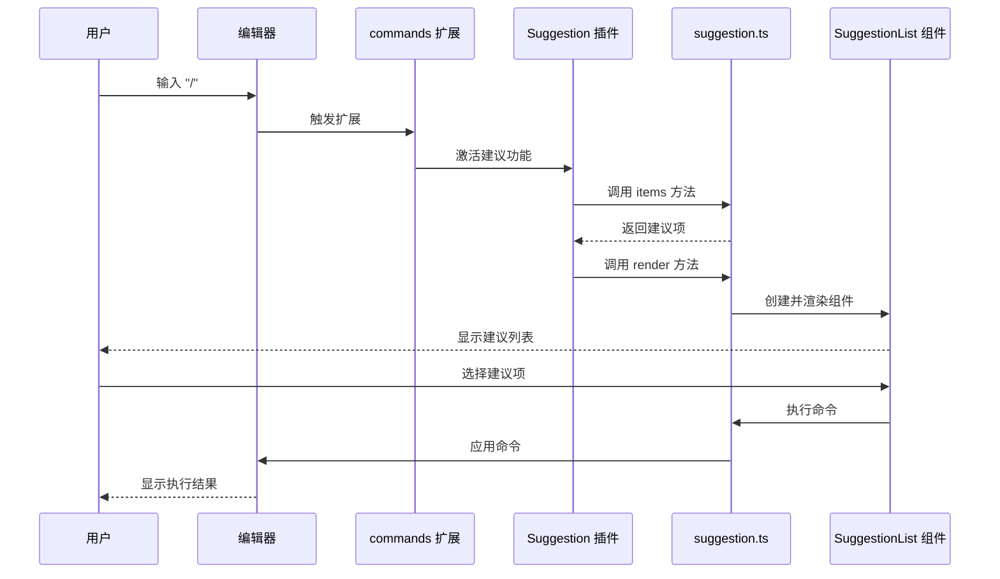

> 本项目基于 Tiptap 官方 experiment 项目 [Slash Commands](https://tiptap.dev/docs/examples/experiments/slash-commands) 重构为 React 版本。

## 功能概述

本项目实现了一个基于 Tiptap 编辑器的 Slash Command 功能，允许用户在编辑器中输入 `/` 触发命令建议列表，然后选择相应的命令执行操作，如添加标题、设置文本格式等。

<!--more-->

## 文件结构

```
slash-commands/app/react/
├── Editor.tsx         # 编辑器组件，集成了 commands 扩展
├── commands.ts        # Tiptap 扩展，集成了 Suggestion 插件
├── suggestion.ts      # 建议功能的核心逻辑
└── SuggestionList.tsx # 建议列表 React 组件
```

## 实现原理

### 1. 扩展注册流程

```mermaid
flowchart TD
    A[用户在编辑器中输入 "/"] --> B[commands.ts 扩展捕获触发字符]
    B --> C[触发 Suggestion 插件]
    C --> D[suggestion.ts 生成建议项]
    D --> E[SuggestionList.tsx 渲染建议列表]
    E --> F[用户选择建议项]
    F --> G[执行对应命令]
```

### 2. 核心组件分析

#### 2.1 commands.ts

`commands.ts` 定义了一个 Tiptap 扩展，集成了 `@tiptap/suggestion` 插件，用于捕获用户输入的 `/` 字符并触发建议功能。

**关键参数**：
- `name`: 扩展名称，设置为 'commands'
- `addOptions()`: 返回配置选项，包含 `suggestion` 配置
  - `char`: 触发字符，设置为 `/`
  - `command`: 命令执行函数，接收 editor、range 和 props 参数
- `addProseMirrorPlugins()`: 返回 ProseMirror 插件数组，包含配置好的 Suggestion 插件

#### 2.2 suggestion.ts

`suggestion.ts` 实现了建议功能的核心逻辑，包括生成建议项和渲染建议列表。

**关键方法**：
- `items({ query })`: 根据查询字符串生成建议项数组，包含标题和命令执行函数
- `render()`: 返回渲染配置对象，包含以下方法：
  - `onStart(props)`: 开始渲染建议列表，创建 React 渲染器并添加到 DOM
  - `onUpdate(props)`: 更新建议列表，更新渲染器属性和位置
  - `onKeyDown(props)`: 处理键盘事件，如 Escape 键关闭建议列表
  - `onExit()`: 退出建议模式，清理渲染器和 DOM 元素

**辅助函数**：
- `updatePosition(editor, element)`: 使用 Floating UI 计算并更新建议列表的位置

**方法调用机制**：
- `items` 方法：由 Tiptap 的 `@tiptap/suggestion` 插件调用，当用户输入触发字符（`/`）后，插件会调用此方法获取建议项
- `render` 方法：由 Tiptap 的 `@tiptap/suggestion` 插件调用，当需要显示建议列表时，插件会调用此方法获取渲染配置

**render 方法返回对象的函数说明**：
- `onStart`: 当建议开始显示时调用，用于初始化渲染器并将建议列表添加到 DOM
- `onUpdate`: 当建议列表需要更新时调用，用于更新渲染器的属性和建议列表的位置
- `onKeyDown`: 当用户按下键盘按键时调用，用于处理键盘导航和选择操作
- `onExit`: 当建议结束显示时调用，用于清理渲染器和 DOM 元素

这些函数的定义是由 Tiptap 的 `@tiptap/suggestion` 插件 API 规定的，按照插件的 API 要求实现这些函数可以确保建议功能的正常工作。

你可以在官方文档中了解更多关于 `@tiptap/suggestion` 插件的 API：

[Suggestion utility | Tiptap Editor Docs](https://tiptap.dev/docs/editor/api/utilities/suggestion)

#### 2.3 SuggestionList.tsx

`SuggestionList.tsx` 是一个 React 组件，用于显示建议列表并处理用户交互。

**关键接口**：
- `CommandItem`: 命令项接口，包含 title 和 command 属性
- `SuggestionListRef`: 建议列表引用接口，包含 onKeyDown 方法
- `SuggestionListProps`: 建议列表属性接口，包含 items、command、editor 和 range 属性

**核心功能**：
- 显示建议列表项
- 处理键盘导航（上下箭头键）
- 处理回车键选择建议项
- 当建议项变化时重置选中索引

#### 2.4 Editor.tsx

`Editor.tsx` 是编辑器组件，集成了 commands 扩展并配置了 suggestion 功能。

**关键配置**：
- 使用 `useEditor` hook 创建编辑器实例
- 注册 `StarterKit` 和 `Commands` 扩展
- 配置 `Commands` 扩展，传入 `suggestion` 对象

## 类型定义

### CommandItem 接口

```typescript
interface CommandItem {
  title: string; // 命令标题，用于显示在建议列表中
  command: (props: { editor: Editor; range: Range }) => void; // 命令执行函数
}
```

### SuggestionListRef 接口

```typescript
interface SuggestionListRef {
  onKeyDown: (props: { event: KeyboardEvent }) => boolean; // 处理键盘事件的方法
}
```

### SuggestionListProps 接口

```typescript
interface SuggestionListProps {
  items: CommandItem[]; // 建议列表项数组
  command: (item: CommandItem) => void; // 命令执行函数
  editor: Editor; // Tiptap 编辑器实例
  range: Range; // 当前选择范围
}
```

## 数据流



## 命令执行流程

1. 用户在编辑器中输入 `/`
2. `commands` 扩展捕获到触发字符，激活 `Suggestion` 插件
3. `suggestion.ts` 中的 `items` 方法根据用户输入生成建议项
4. `suggestion.ts` 中的 `render` 方法创建 `ReactRenderer` 并渲染 `SuggestionList` 组件
5. 用户通过键盘导航或鼠标点击选择建议项
6. `SuggestionList` 组件调用 `selectItem` 方法执行对应命令
7. 命令通过 `editor.chain()` 执行，如设置标题、添加格式等
8. 命令执行完成后，建议列表自动关闭

## 核心功能

### 1. 命令建议生成

当用户输入 `/` 后，系统会根据输入的查询字符串过滤命令建议，只显示匹配的命令项。目前支持的命令包括：

- Heading 1: 添加一级标题
- Heading 2: 添加二级标题
- Bold: 设置文本为粗体
- Italic: 设置文本为斜体

### 2. 键盘导航

用户可以使用上下箭头键在建议列表中导航，使用回车键选择当前高亮的建议项。

### 3. 位置计算

使用 Floating UI 库计算建议列表的位置，确保其显示在编辑器光标下方，并且在视口边缘时自动调整位置。

### 4. 响应式更新

当用户输入变化时，建议列表会实时更新，显示匹配的命令项。

## 集成方式

要在 Tiptap 编辑器中使用此功能，需要：

1. 导入 `Commands` 扩展和 `suggestion` 对象
2. 在编辑器配置中注册 `Commands` 扩展，并传入 `suggestion` 对象

```typescript
import Commands from './commands';
import { suggestion } from './suggestion';

const editor = useEditor({
  extensions: [
    StarterKit,
    Commands.configure({
      suggestion,
    }),
  ],
  // 其他配置...
});
```

## 自定义扩展

### 添加新命令

要添加新命令，只需在 `suggestion.ts` 文件的 `items` 方法中添加新的命令对象：

```typescript
{
  title: '新命令',
  command: ({ editor, range }) => {
    // 命令执行逻辑
  },
}
```

### 自定义建议列表样式

建议列表的样式定义在 `suggestion.css` 文件中，可以根据需要修改样式。

## 技术栈

- React
- TypeScript
- Tiptap
- @tiptap/suggestion
- @floating-ui/dom

## 总结

本实现通过 Tiptap 的 Suggestion 插件和 React 组件，为编辑器添加了 Slash Command 功能，使用户可以更方便地执行各种编辑操作。核心逻辑清晰，代码结构合理，易于扩展和维护。

## QnA

### 1. onStart 等传递的 props 在哪里定义的？

`suggestion.ts` 文件中 `render` 方法返回的对象中的 `onStart` 等方法传递的 props 是由 Tiptap 的 `@tiptap/suggestion` 插件定义的。这些 props 包含了编辑器实例、当前选择范围、客户端矩形等信息，用于渲染和定位建议列表。

具体来说，当用户输入触发字符（如 `/`）时，Tiptap 的 Suggestion 插件会收集相关信息，然后调用 `render` 方法返回的对象中的 `onStart` 方法，并将这些信息作为 props 传递给它。

### 2. SuggestionList 的 props.items、props.command 还有 ref 是在哪里定义的，如何理解 forwardRef 在这里的使用？

- **props.items** 和 **props.command**：这些是在 `SuggestionListProps` 接口中定义的，位于 `SuggestionList.tsx` 文件中。当 `suggestion.ts` 中的 `onStart` 方法创建 `ReactRenderer` 实例时，会将这些属性传递给 `SuggestionList` 组件。

- **ref**：`SuggestionListRef` 接口定义了组件对外暴露的方法，主要是 `onKeyDown` 方法。`forwardRef` 在这里的使用是为了将组件内部的 `handleKeyDown` 方法暴露给父组件（即 `suggestion.ts` 中的渲染逻辑），以便父组件可以在用户按下键盘按键时调用这个方法。

`forwardRef<SuggestionListRef, SuggestionListProps>` 的含义是：
- 第一个泛型参数 `SuggestionListRef`：定义了通过 ref 暴露给父组件的方法和属性
- 第二个泛型参数 `SuggestionListProps`：定义了组件接收的属性类型

这样，父组件可以通过 ref 调用 `SuggestionList` 组件的 `onKeyDown` 方法，实现键盘事件的处理。

### 3. Suggestion 必需是一个列表吗，可以实现其他例如横向排列的带输入框的按钮组或者其他视图吗？

Suggestion 不一定必须是一个列表，它可以是任何你想要的视图形式，包括横向排列的带输入框的按钮组或其他视图。

实现方式：
- 在 `suggestion.ts` 的 `render` 方法中，你可以返回一个对象，该对象的方法可以渲染任何你想要的视图
- 你可以使用 `ReactRenderer` 或其他渲染方式来渲染自定义的 React 组件
- 在自定义组件中，你可以实现任何布局和交互逻辑，如横向排列的按钮组、带输入框的界面等

关键在于 `render` 方法返回的对象需要实现 Tiptap Suggestion 插件要求的生命周期方法（如 `onStart`、`onUpdate`、`onKeyDown`、`onExit`），以便与 Tiptap 编辑器正确集成。

例如，你可以创建一个横向排列的按钮组组件，在 `onStart` 中渲染它，在 `onUpdate` 中更新它的位置和内容，在 `onKeyDown` 中处理键盘事件，在 `onExit` 中清理它。

### 4. 如何了解更多关于 Tiptap Extension API 的信息？

Tiptap 提供了详细的 Extension API 文档，你可以在官方文档中找到更多关于如何创建和自定义扩展的信息：

[Extension API | Tiptap Editor Docs](https://tiptap.dev/docs/editor/extensions/custom-extensions/create-new/extension)

该文档详细介绍了扩展的基本结构、配置选项、存储管理等内容，对于理解和扩展 Tiptap 编辑器功能非常有帮助。

### 5. 什么是 Tiptap Extension？

Tiptap Extension 是 Tiptap 编辑器的核心概念，用于增强编辑器功能或修改编辑器行为。它们是 Tiptap 的构建块，可以添加新的内容类型、自定义编辑器外观或扩展其功能。

你可以在官方文档中了解更多关于 Extension 的概念：

[Extensions | Tiptap Editor Docs](https://tiptap.dev/docs/editor/core-concepts/extensions)

该文档详细介绍了 Extension 的关键功能、类型以及如何创建和使用它们。
